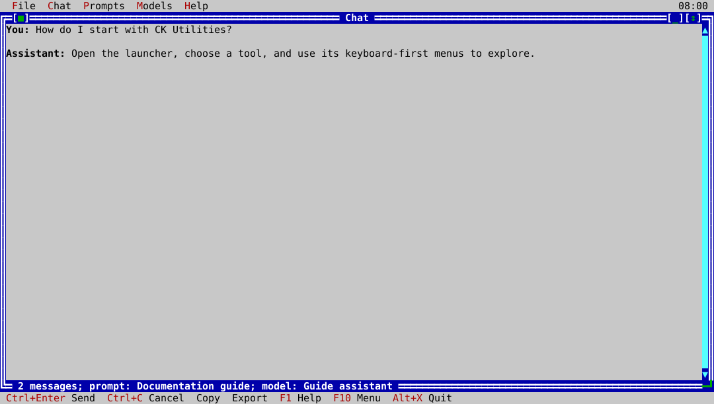

# ck-chat

`ck-chat` is the native terminal interface for the configured local GGUF
model. It loads AI configuration from `~/.config/cktools/ckai.toml`, lets you
manage models and system prompts, streams and cancels responses, and exports
conversations from the interactive application.



A missing or unusable model is shown as an error in the transcript. The
product never silently falls back to a deterministic test response.

## Usage

```bash
ck-chat
```

Copy `configs/ckai.example.toml` to `~/.config/cktools/ckai.toml` and set a
valid local GGUF path before sending a response. Use `ck-chat --help` for the
command-line synopsis; prompts are entered through the native interface.
