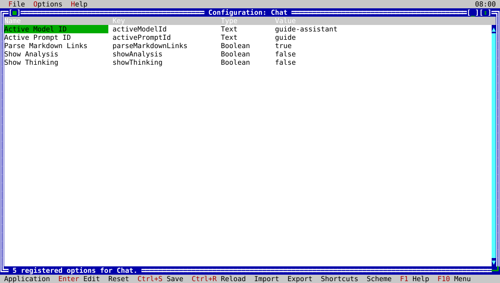

# ck-config

`ck-config` is the native ckVision configuration editor for CK Utilities. It
currently manages the Disk Usage and Chat option profiles, plus the suite's
keyboard shortcut schemes.



## Usage

```text
ck-config
```

Use `--help` (or `-h`) to show the command-line usage.

## Option profiles

Use **Options** to select Disk Usage or Chat, inspect its registered settings,
edit or reset the selected setting, and save or reload the active profile.
Import and export operate on the selected application's profile. Values are
validated before they are committed; failed imports preserve the existing
configuration.

Some settings are derived and appear as read-only. They remain visible but
cannot be edited or reset from the native interface.

## Keyboard shortcuts

Choose **Configure keyboard shortcuts** to browse commands for each target
application and shared suite commands. Captured shortcuts are normalized before
they are saved. If a binding is already occupied, `ck-config` identifies the
conflict and requires an explicit replacement.

The application distinguishes built-in default shortcuts from personal
bindings. Selecting defaults does not erase personal bindings; the next
shortcut edit returns to the personal scheme.
