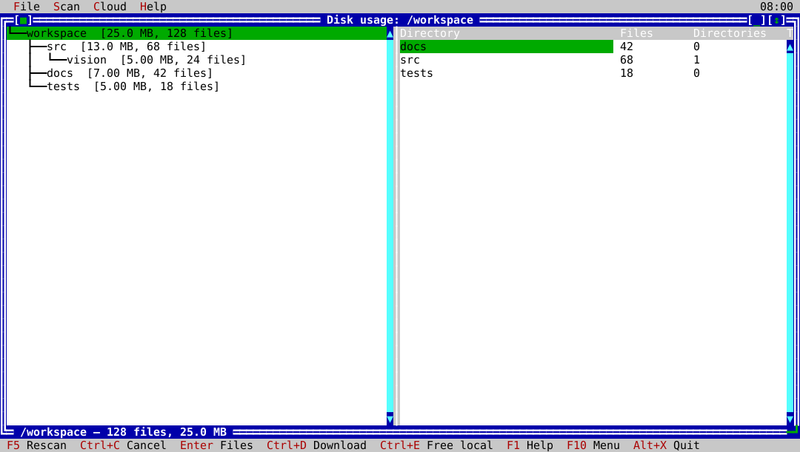

# ck-du

`ck-du` is the native ckVision disk-usage explorer. It scans a directory in the
background and presents a navigable directory tree and file listings without
requiring `du` command pipelines.



## Usage

```text
ck-du [DIRECTORY]
```

`DIRECTORY` defaults to the current directory. Use `--help` (or `-h`) to show
the command-line usage.

## Native workflow

- **Scan:** rescan the requested directory, cancel an in-progress scan, or
  view files for the selected directory.
- The tree preserves a valid prior result while a rescan is underway; a
  cancelled or invalid replacement does not discard the visible snapshot.
- Saved Disk Usage options control the scan policy, including filtering,
  symlink handling, filesystem boundaries, and related reporting choices.
  Manage those options through `ck-config`.

## Cloud actions

The Cloud menu has one supported provider: macOS iCloud Drive. It can request
an iCloud download for one eligible selected directory inside the current scan
root, and can offer a confirmed request to free local copies only after macOS
reports the directory uploaded. Symbolic links, non-directories, paths outside
the scan root, and all other providers are explicitly refused rather than
claiming to change remote or local cloud state.

Cloud requests are cancellable and never retry automatically. A successful
result means that macOS accepted the one request; it is not an immediate
guarantee that background synchronization or provider-defined recursion has
completed. If cancellation arrives after acceptance, the app reports both
facts so the provider's possible background work is not hidden.
