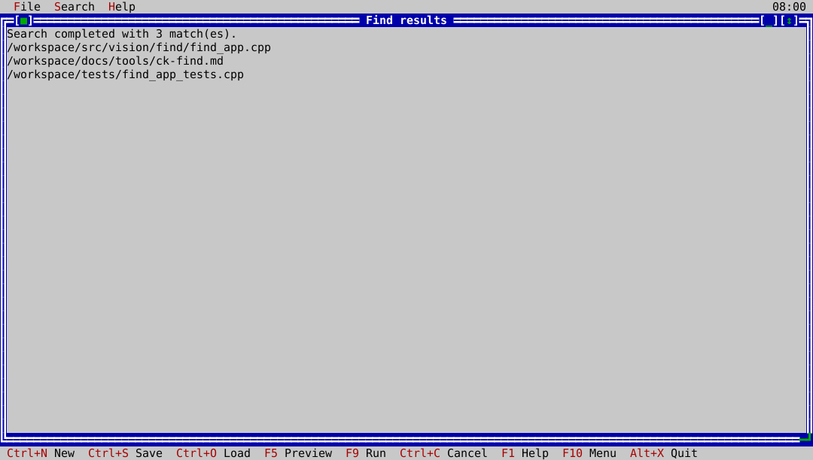

# ck-find

`ck-find` is the native ckVision search workflow. It provides one guided,
scrolling form for a named search, start location, text matching, include and
exclude patterns, traversal policy, file types, date range, size range,
permission audit, and safe result actions. The generated command plan is
available for preview, while the search itself runs through a cancellable
background service and returns results to the interface.



## Usage

```bash
ck-find
```

Use `ck-find --help` for the command-line synopsis. Search creation, loading,
saving, previewing, running, and cancellation are available from the native
menus and status line.

## Safe actions

Deleting matches requires an explicit confirmation and is limited to matching
regular files and symbolic links; directories are never removed. Existing
saved custom-command settings are retained for compatibility, but they are
never interpreted by a shell. On macOS, the guided form can select one of two
fixed read-only templates: `ckvision.file-info` (file metadata) or
`ckvision.sha256` (a SHA-256 digest). Every other saved value is refused.

The native executor previews its direct argv and requires a second explicit
confirmation. It runs from the selected search root through the macOS sandbox,
with network and file writes denied. Matched paths are passed as literal argv
values. Each invocation has a five-second limit and 16 KiB output limit; a
run stops after 64 matched paths and reports its bounded audit outcome. Custom
commands cannot be combined with deletion. The capability remains explicitly
unavailable on platforms without the tested macOS sandbox executor.
