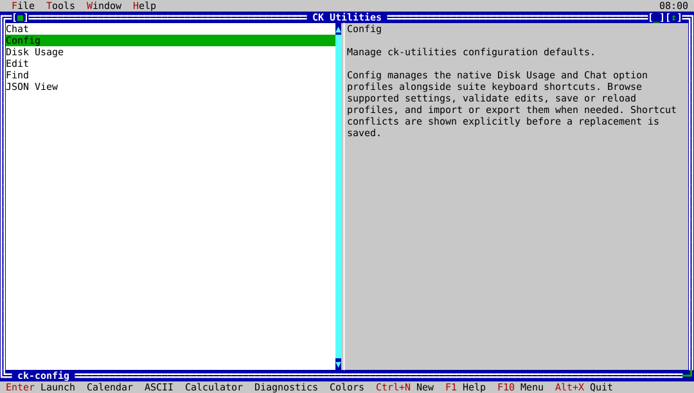

# ck-utilities

`ck-utilities` is the native ckVision launcher for the CK Utilities suite. It
lists the installed tools and provides shared window, theme, help, and quit
behavior.



## Usage

```text
ck-utilities [--launch TOOL [ARGS...]]
```

Run `ck-utilities` without arguments to open the interactive launcher. Use
`--launch` to start an installed sibling tool directly; the launcher's exit
status is the child tool's exit status.

```text
ck-utilities --launch ck-json-view example.json
ck-utilities --launch ck-du .
```

Use `--help` (or `-h`) to show the command-line usage. An unknown tool or a
missing `--launch` argument fails before a child process is started.

## Native launcher windows

From the **Tools** menu, open a new launcher window or native windows for the
calendar, ASCII table, calculator, color selector, and bounded application
diagnostics. Select a listed tool and choose **Launch selected tool** to open
it through the same installed-sibling lookup used by `--launch`.

Keyboard shortcuts are configurable through `ck-config`; consult the live menu
and status line for the active bindings.
